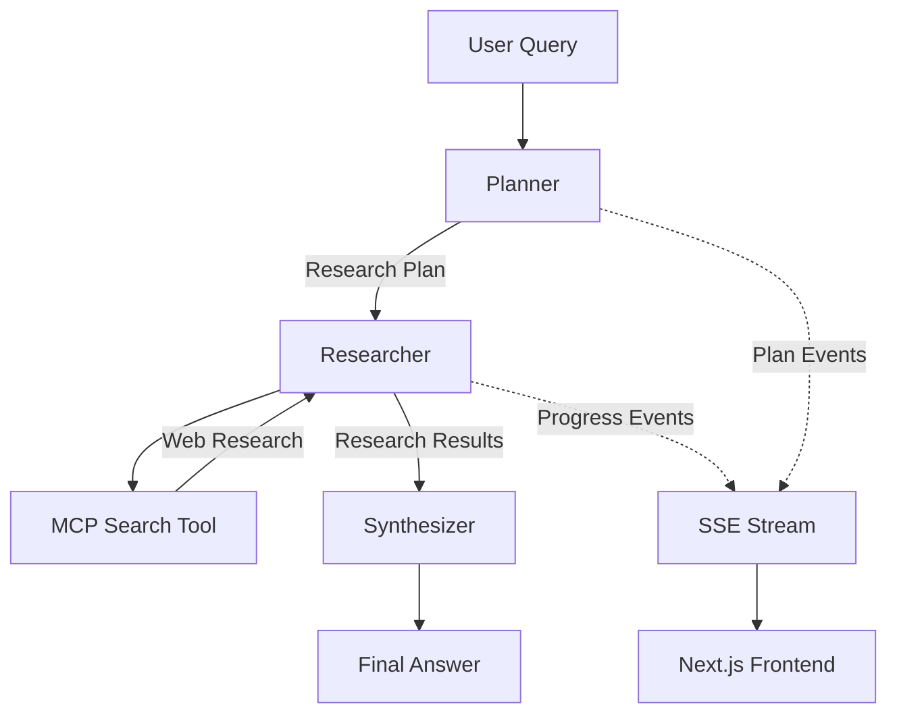

# Research Agent

An AI-powered research assistant built with **Next.js, FastAPI, LangGraph, MCP, OpenRouter, and Server-Sent Events (SSE)**.

The project explores how to build a modular **agentic research system** capable of breaking complex questions into research tasks, performing web research through MCP tools, and synthesizing the collected information into a final answer.

> **Work in progress — v1**

---

## Architecture

The research workflow is built using **LangGraph** and follows a structured pipeline:



### Research Flow

```text
User Query
    │
    ▼
┌─────────────┐
│   Planner   │
└──────┬──────┘
       │
       │ Research Tasks
       ▼
┌─────────────┐
│  Researcher │
└──────┬──────┘
       │
       │ MCP
       ▼
┌─────────────────┐
│  Search Tool    │
│   (Web Search)  │
└────────┬────────┘
         │
         │ Research Results
         ▼
┌─────────────┐
│ Synthesizer │
└──────┬──────┘
       │
       ▼
  Final Answer
```

---

## Agentic Workflow

### 1. Planner

The **Planner** receives the user's question and breaks it into several concrete research tasks.

For example:

```text
User:
"Compare Python and TypeScript for building AI-powered web applications."

Planner:
├── Investigate AI/ML libraries and frameworks
├── Compare ecosystem maturity
├── Compare performance characteristics
├── Compare web-development ecosystems
└── Evaluate developer experience
```

The planner uses **structured output** with a Pydantic schema so that the generated research plan can be passed directly into the next LangGraph node.

The planner is responsible only for **decomposing the problem**. It does not perform the research or synthesize the final answer.

---

### 2. Researcher

The **Researcher** receives the generated plan and executes each research task.

It discovers the available MCP tools and uses the MCP `search` tool to perform web searches.

Each task produces progress events:

```text
⟳ Investigate AI/ML libraries and frameworks
✓ Investigate AI/ML libraries and frameworks

⟳ Compare ecosystem maturity
✓ Compare ecosystem maturity

⟳ Compare performance characteristics
✓ Compare performance characteristics
```

The research results are collected and passed to the Synthesizer.

---

### 3. MCP Tool Integration

Web search is separated from the main agent through an **MCP server**.

```text
LangGraph Researcher
        │
        ▼
   MCP Client
        │
        ▼
   MCP Server
        │
        ▼
    search()
        │
        ▼
   Tavily Web Search
```

This keeps external tools modular and allows additional MCP tools to be added without tightly coupling them to the agent implementation.

The MCP server currently exposes a `search` tool backed by web search functionality.

---

### 4. Synthesizer

After all research tasks are completed, the collected research is passed to a dedicated **Synthesizer** node.

Its responsibility is to:

- Analyze the collected research
- Combine information from multiple searches
- Resolve the findings into a coherent response
- Generate the final answer for the user

This keeps **research** and **answer generation** as separate stages of the workflow.

```text
Planner
   │
   ▼
Research Tasks
   │
   ▼
Web Research
   │
   ▼
Collected Findings
   │
   ▼
Synthesizer
   │
   ▼
Final Answer
```

---

## Real-Time Streaming

The backend uses **Server-Sent Events (SSE)** to stream agent progress to the frontend.

LangGraph emits different types of events during execution:

```text
Planner
   │
   └── plan events

Researcher
   │
   ├── task_started
   └── task_completed

Synthesizer
   │
   └── final answer
```

The frontend can therefore display the agent's progress while the research is happening instead of waiting for the entire workflow to finish.

Example:

```text
Researching...

✓ Identify AI/ML libraries
✓ Compare ecosystem maturity
⟳ Analyze performance
○ Compare web frameworks
○ Evaluate developer experience
```

---

## Tech Stack

### Frontend

- Next.js
- TypeScript
- Tailwind CSS

### Backend

- Python
- FastAPI
- LangChain
- LangGraph
- Pydantic

### AI / LLM

- OpenRouter
- OpenAI-compatible API

### Agent Tools

- MCP
- Tavily
- LangChain MCP Adapters

### Streaming

- Server-Sent Events (SSE)
- `sse-starlette`

---

## Project Structure

research-agent/
│
├── backend/
│   └── src/
│       └── backend/
│           ├── agent/
│           │   ├── agent.py
│           │   ├── planner.py
│           │   ├── researcher.py
│           │   ├── state.py
│           │   └── synthesizer.py
│           │
│           ├── api/
│           │   └── routes/
│           │       └── research.py
│           │
│           ├── core/
│           │   └── config.py
│           │
│           ├── mcp/
│           │   └── client.py
│           │
│           ├── schemas/
│           │   └── research.py
│           │
│           └── tools/
│
├── client/
│   ├── app/
│   │   ├── layout.tsx
│   │   ├── page.tsx
│   │   └── ...
│   │
│   ├── components/
│   │   └── ...
│   │
│   ├── public/
│   │   └── ...
│   │
│   ├── package.json
│   └── ...
│
├── mcp-server/
│   └── mcp_server/
│       ├── __init__.py
│       ├── config.py
│       ├── server.py
│       │
│       └── tools/
│           ├── __init__.py
│           └── search.py
│
└── README.md

---

## Current Architecture

The current v1 architecture consists of:

- **LangGraph state machine**
- **Planner → Researcher → Synthesizer workflow**
- Structured research planning with **Pydantic**
- MCP-based web search
- Tavily search integration
- Custom LangGraph progress events
- FastAPI backend
- SSE-based event streaming
- Next.js frontend
- OpenRouter LLM integration


## Goal

The long-term goal is to build a reliable, modular research agent that can autonomously:

```text
Understand Question
       ↓
Plan Research
       ↓
Execute Research
       ↓
Collect Evidence
       ↓
Synthesize Findings
       ↓
Generate Answer
```

while providing the user with **real-time visibility into what the agent is doing**.

> This project is primarily an exploration of **AI agent architecture, LangGraph workflows, MCP tool integration, and production-oriented streaming systems**.