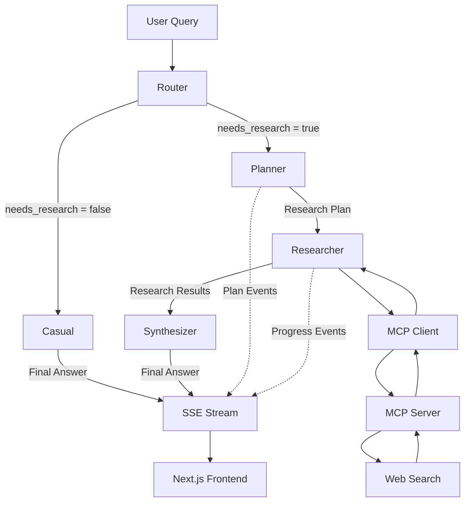

# Research Agent

An AI-powered research assistant built with **Next.js, FastAPI, LangGraph, MCP, OpenRouter, and Server-Sent Events (SSE)**.

The project explores how to build a modular **agentic research system** capable of:

- Determining whether a user request actually requires research
- Handling casual conversation directly
- Breaking complex questions into focused research tasks
- Performing web research through MCP tools
- Tracking research progress in real time
- Synthesizing collected findings into a final answer
- Streaming the agent's execution back to the frontend

> **Work in progress — v1**

> This project is primarily an exploration of **AI agent architecture, LangGraph workflows, MCP tool integration, intent-based routing, modular agent design, and production-oriented streaming systems**.

---

## Architecture

The research workflow is built using **LangGraph** and follows a conditional agentic pipeline.



### High-Level Flow

```text
                    User Query
                        │
                        ▼
                 ┌─────────────┐
                 │    Router   │
                 └──────┬──────┘
                        │
              ┌─────────┴─────────┐
              │                   │
              ▼                   ▼
       needs_research       needs_research
           = false               = true
              │                   │
              ▼                   ▼
        ┌──────────┐       ┌─────────────┐
        │  Casual  │       │   Planner   │
        └────┬─────┘       └──────┬──────┘
             │                    │
             │                    ▼
             │             ┌─────────────┐
             │             │  Researcher │
             │             └──────┬──────┘
             │                    │
             │                    │ MCP
             │                    ▼
             │             ┌─────────────┐
             │             │ MCP Client  │
             │             └──────┬──────┘
             │                    │
             │                    ▼
             │             ┌─────────────┐
             │             │ MCP Server  │
             │             └──────┬──────┘
             │                    │
             │                    ▼
             │             ┌─────────────┐
             │             │ Web Search  │
             │             └──────┬──────┘
             │                    │
             │                    │ Research Results
             │                    ▼
             │             ┌─────────────┐
             │             │ Synthesizer │
             │             └──────┬──────┘
             │                    │
             └──────────┬─────────┘
                        │
                        ▼
                  Final Answer
                        │
                        ▼
                    SSE Stream
                        │
                        ▼
                Next.js Frontend
```

---

## Agentic Workflow

The agent is divided into independent responsibilities rather than using a single monolithic LLM call.

### 1. Router

The **Router** is the first node in the LangGraph workflow.

Its responsibility is to determine whether the user's message requires web research.

For example:

```text
User:
"Hey, what's up?"

Router:
needs_research = false
        │
        ▼
      Casual
```

While a research-oriented request follows a different path:

```text
User:
"What are the latest developments in AI agents?"

Router:
needs_research = true
        │
        ▼
     Planner
```

The router uses the LLM to classify the user's intent and writes the result into the LangGraph state as:

```python
{
    "needs_research": True
}
```

or:

```python
{
    "needs_research": False
}
```

This decision is then used by LangGraph's conditional routing to determine which node executes next.

The Router prevents unnecessary research operations for conversations that do not require external information.

---

### 2. Casual

The **Casual** node handles normal conversation when the Router determines that research is unnecessary.

Examples include:

```text
"Hey, what's up?"
"How are you?"
"Tell me a joke."
"Thanks!"
```

The Casual node directly generates a response using the configured LLM.

```text
User Query
    │
    ▼
  Router
    │
    │ needs_research = false
    ▼
  Casual
    │
    ▼
Final Answer
```

The casual response is streamed through the same `final_answer` SSE event used by the research workflow.

This means the frontend does not need a separate response mechanism for casual conversation.

---

### 3. Planner

For queries that require research, the **Planner** receives the user's question and breaks it into several concrete research tasks.

For example:

```text
User:
"Compare Python and TypeScript for building AI-powered web applications."

Planner:
├── Investigate AI/ML libraries and frameworks
├── Compare ecosystem maturity
├── Compare performance characteristics
├── Compare web-development ecosystems
└── Evaluate developer experience
```

The Planner uses **structured output** with a Pydantic schema:

```python
class ResearchPlan(BaseModel):
    tasks: list[str]
```

The generated tasks are stored in the LangGraph state and passed to the Researcher.

The Planner is responsible only for **decomposing the problem**.

It does not:

- Perform web searches
- Collect research
- Generate the final answer

This separation keeps planning independent from execution and synthesis.

---

### 4. Researcher

The **Researcher** receives the generated plan and executes each research task.

For every task, it:

1. Retrieves the available MCP tools.
2. Selects the MCP `search` tool.
3. Sends the research task to the search tool.
4. Collects the returned research.
5. Emits progress events while the task is running.
6. Continues until all planned tasks have been researched.

Example progress:

```text
⟳ Investigate AI/ML libraries and frameworks
✓ Investigate AI/ML libraries and frameworks

⟳ Compare ecosystem maturity
✓ Compare ecosystem maturity

⟳ Compare performance characteristics
✓ Compare performance characteristics
```

Once all tasks are complete, the collected research is passed to the Synthesizer.

The Researcher does not generate the final response. Its responsibility is **research execution and evidence collection**.

---

### 5. MCP Tool Integration

Web search is separated from the main agent through an **MCP server**.

```text
┌────────────────────┐
│ LangGraph          │
│ Researcher         │
└─────────┬──────────┘
          │
          ▼
┌────────────────────┐
│ MCP Client         │
└─────────┬──────────┘
          │
          ▼
┌────────────────────┐
│ MCP Server         │
│                    │
│ search()           │
└─────────┬──────────┘
          │
          ▼
┌────────────────────┐
│    Web Search      │
│      Tavily        │
└────────────────────┘
```

The MCP server currently exposes a `search` tool backed by **Tavily**.

The main research agent communicates with the MCP server through the **LangChain MCP adapters**.

This separation keeps external capabilities modular.

Additional tools can be exposed through MCP without tightly coupling them to the core LangGraph workflow.

---

### 6. Synthesizer

After all research tasks are completed, the collected research is passed to a dedicated **Synthesizer** node.

Its responsibility is to:

- Analyze the collected research
- Combine information from multiple searches
- Use the research as the source of truth
- Produce a coherent response
- Avoid inventing unsupported facts
- Indicate when the collected research is insufficient

The workflow therefore separates:

```text
Planning
    │
    ▼
Research Execution
    │
    ▼
Evidence Collection
    │
    ▼
Synthesis
    │
    ▼
Final Answer
```

This separation makes the system easier to reason about and extend.

---

## Conditional Routing

The current LangGraph workflow uses conditional routing after the Router node.

```text
                 ┌─────────────┐
                 │    Router   │
                 └──────┬──────┘
                        │
                ┌───────┴────────┐
                │                │
             False              True
                │                │
                ▼                ▼
           ┌─────────┐      ┌──────────┐
           │  Casual │      │ Planner  │
           └────┬────┘      └────┬─────┘
                │                │
                │                ▼
                │          ┌───────────┐
                │          │ Researcher│
                │          └─────┬─────┘
                │                │
                │                ▼
                │          ┌───────────┐
                │          │Synthesizer│
                │          └─────┬─────┘
                │                │
                └───────┬────────┘
                        ▼
                  Final Answer
```

This avoids the earlier approach where every message entered the Planner.

The agent now has an explicit **decision layer** before research execution.

---

## LangGraph State

The workflow shares information between nodes through a typed `ResearchState`.

```python
class ResearchState(TypedDict):
    query: str
    needs_research: bool
    plan: list[str]
    research: list[str]
    answer: str
```

The state represents the current execution context of the agent.

### State Flow

```text
query
  │
  ▼
Router
  │
  └── needs_research
          │
          ▼
       Planner
          │
          └── plan
                 │
                 ▼
             Researcher
                 │
                 └── research
                        │
                        ▼
                   Synthesizer
                        │
                        └── answer
```

This shared state allows individual nodes to remain focused on a single responsibility.

---

## Real-Time Streaming

The backend uses **Server-Sent Events (SSE)** to stream agent activity to the frontend.

LangGraph produces different event types during execution.

### Research Path

```text
Router
  │
  └── routing decision

Planner
  │
  ├── planning
  └── plan

Researcher
  │
  ├── task_started
  └── task_completed

Synthesizer
  │
  ├── synthesis_started
  └── final_answer
```

### Casual Path

```text
Router
  │
  └── routing decision

Casual
  │
  └── final_answer
```

Both paths ultimately use the same `final_answer` SSE event.

This allows the existing frontend response handler to display both researched and casual responses without requiring a separate frontend response pipeline.

---

## Research Progress Events

The Researcher uses LangGraph custom stream events to communicate execution progress.

Example:

```text
Research progress

Research task: Investigate AI agent frameworks
Researching: Investigate AI agent frameworks
Completed: Investigate AI agent frameworks

Research task: Compare framework capabilities
Researching: Compare framework capabilities
Completed: Compare framework capabilities

Synthesizing...
```

The backend converts these internal LangGraph events into SSE events that can be consumed by the Next.js frontend.

This provides **real-time visibility into the agent's execution** instead of forcing the user to wait for the complete workflow.

---

## SSE Event Flow

```text
LangGraph
    │
    ├── updates
    │     ├── router
    │     ├── planner
    │     └── synthesizer
    │
    └── custom
          ├── task_started
          └── task_completed
             │
             ▼
      FastAPI SSE Endpoint
             │
             ▼
      EventSourceResponse
             │
             ▼
       Next.js Frontend
```

The frontend consumes the SSE response using the browser's streaming `ReadableStream` API.

---

## Tech Stack

### Frontend

- Next.js
- TypeScript
- Tailwind CSS
- App Router
- Fetch API
- ReadableStream

### Backend

- Python
- FastAPI
- LangChain
- LangGraph
- Pydantic

### AI / LLM

- OpenRouter
- OpenAI-compatible API

### Agent Tools

- MCP
- Tavily
- LangChain MCP Adapters

### Streaming

- Server-Sent Events (SSE)
- `sse-starlette`
- LangGraph streaming

---

## Project Structure

```text
research-agent/
│
├── backend/
│   └── src/
│       └── backend/
│           ├── agent/
│           │   ├── agent.py
│           │   ├── router.py
│           │   ├── casual.py
│           │   ├── planner.py
│           │   ├── researcher.py
│           │   ├── state.py
│           │   └── synthesizer.py
│           │
│           ├── api/
│           │   └── routes/
│           │       └── research.py
│           │
│           ├── core/
│           │   └── config.py
│           │
│           ├── mcp/
│           │   └── client.py
│           │
│           ├── schemas/
│           │   └── research.py
│           │
│           └── tools/
│
├── client/
│   ├── app/
│   │   ├── layout.tsx
│   │   ├── page.tsx
│   │   └── ...
│   │
│   ├── components/
│   │   └── ...
│   │
│   ├── public/
│   │   └── ...
│   │
│   ├── package.json
│   └── ...
│
├── mcp-server/
│   └── mcp_server/
│       ├── __init__.py
│       ├── config.py
│       ├── server.py
│       │
│       └── tools/
│           ├── __init__.py
│           └── search.py
│
└── README.md
```

### Backend

The backend contains the core agent architecture and API.

- `agent/` — LangGraph workflow and agent nodes
- `agent/agent.py` — LangGraph graph construction and conditional routing
- `agent/router.py` — LLM-based research/casual routing
- `agent/casual.py` — Casual conversation handler
- `agent/planner.py` — Research task decomposition
- `agent/researcher.py` — MCP-based research execution
- `agent/synthesizer.py` — Research synthesis and final answer generation
- `agent/state.py` — Shared LangGraph state definition
- `api/routes/` — FastAPI API endpoints
- `core/` — Application configuration
- `mcp/` — MCP client communication
- `schemas/` — Pydantic schemas
- `tools/` — Backend-side tools and utilities

### Client

The client is a **Next.js App Router** application responsible for:

- Providing the research interface
- Sending user queries to the FastAPI backend
- Consuming the SSE stream
- Displaying research progress
- Displaying final answers

The frontend uses the same `final_answer` event for both researched and casual responses.

### MCP Server

The MCP server provides external tools to the research agent.

- `server.py` — MCP server initialization and tool registration
- `config.py` — MCP server configuration
- `tools/search.py` — Tavily-powered web search implementation

---

## Current Architecture

The current v1 architecture consists of:

- **LLM-based intent router**
- **Conditional LangGraph routing**
- Casual conversation handling
- **Planner → Researcher → Synthesizer workflow**
- Structured research planning with **Pydantic**
- MCP-based tool integration
- Tavily web search
- LangChain MCP adapters
- Custom LangGraph progress events
- FastAPI backend
- SSE-based event streaming
- Next.js frontend
- OpenRouter LLM integration
- Shared typed LangGraph state

The main architecture is intentionally separated into independent stages:

```text
                         ┌───────────┐
                         │  Router   │
                         └─────┬─────┘
                               │
                    ┌──────────┴──────────┐
                    │                     │
                 Casual                Research
                    │                     │
                    │                     ▼
                    │                ┌───────────┐
                    │                │  Planner  │
                    │                └─────┬─────┘
                    │                      │
                    │                Research Plan
                    │                      │
                    │                      ▼
                    │                ┌───────────┐
                    │                │ Researcher│
                    │                └─────┬─────┘
                    │                      │
                    │                 MCP Search
                    │                      │
                    │                      ▼
                    │                ┌───────────┐
                    │                │ Synthesizer│
                    │                └─────┬─────┘
                    │                      │
                    └──────────┬───────────┘
                               ▼
                         Final Answer
                               │
                               ▼
                           SSE Stream
                               │
                               ▼
                        Next.js Frontend
```

---

## Architectural Improvements

The current version improves on the original linear workflow in several ways.

### Intent-Aware Execution

Previously, every query entered the research pipeline.

The Router now determines whether research is necessary before invoking the Planner.

```text
Before:

User → Planner → Researcher → Synthesizer


Now:

User → Router
          │
          ├── Casual
          │
          └── Planner → Researcher → Synthesizer
```

This makes the workflow more efficient and introduces a clear decision-making layer.

### Separation of Responsibilities

Each node now has a specific responsibility:

```text
Router       → Decide what type of execution is required
Casual       → Handle normal conversation
Planner      → Decompose research questions
Researcher   → Execute research tasks
Synthesizer  → Generate the final answer
```

This makes individual components easier to test, replace, and extend.

### No Hardcoded Casual Detection

Casual conversation is not determined through a hardcoded list of phrases.

Instead, the LLM Router makes the decision dynamically.

This allows the system to handle a wider variety of natural user inputs without maintaining a growing collection of keyword rules.

### Shared Streaming Interface

Both execution paths ultimately produce:

```text
final_answer
```

through the SSE layer.

This keeps the frontend architecture simple while allowing the backend workflow to become more sophisticated.

---

## Goal

The long-term goal is to build a reliable, modular research agent that can autonomously:

```text
Understand User Intent
        ↓
Decide Whether Research Is Needed
        ↓
 ┌──────┴──────┐
 │             │
Casual       Research
 │             │
 │             ▼
 │        Plan Research
 │             ↓
 │        Execute Research
 │             ↓
 │        Collect Evidence
 │             ↓
 │        Synthesize Findings
 │             │
 └──────┬──────┘
        ↓
Generate Answer
        ↓
Stream to User
```

while providing the user with **real-time visibility into what the agent is doing**.

