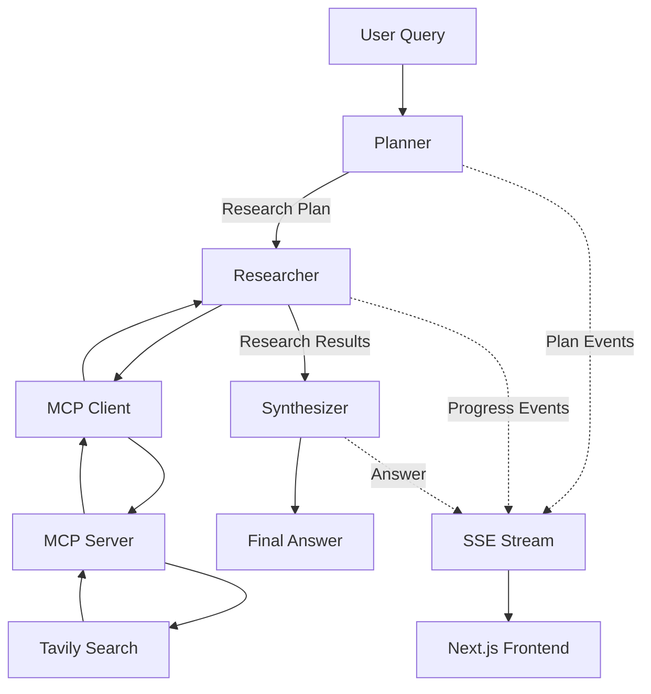

# Research Agent

An AI-powered research assistant built with **Next.js, FastAPI, LangGraph, MCP, OpenRouter, and Server-Sent Events (SSE)**.

The project explores how to build a modular **agentic research system** capable of breaking complex questions into research tasks, performing web research through MCP tools, and synthesizing the collected information into a final answer.

> **Work in progress — v1**

---

## Architecture

The research workflow is built using **LangGraph** and follows a structured pipeline:



### Research Flow

```text
User Query
    │
    ▼
┌─────────────┐
│   Planner   │
└──────┬──────┘
       │
       │ Research Tasks
       ▼
┌─────────────┐
│  Researcher │
└──────┬──────┘
       │
       │ MCP
       ▼
┌─────────────┐
│ MCP Client  │
└──────┬──────┘
       │
       ▼
┌─────────────┐
│ MCP Server  │
└──────┬──────┘
       │
       ▼
┌─────────────┐
│ Tavily      │
│ Web Search  │
└──────┬──────┘
       │
       │ Research Results
       ▼
┌─────────────┐
│ Synthesizer │
└──────┬──────┘
       │
       ▼
  Final Answer
```

---

## Agentic Workflow

### 1. Planner

The **Planner** receives the user's question and breaks it into several concrete research tasks.

For example:

```text
User:
"Compare Python and TypeScript for building AI-powered web applications."

Planner:
├── Investigate AI/ML libraries and frameworks
├── Compare ecosystem maturity
├── Compare performance characteristics
├── Compare web-development ecosystems
└── Evaluate developer experience
```

The planner uses **structured output** with a Pydantic schema so the generated research plan can be passed directly into the next LangGraph node.

The Planner is responsible only for **decomposing the problem**. It does not perform web research or synthesize the final answer.

---

### 2. Researcher

The **Researcher** receives the generated plan and executes each research task.

For every task, it:

1. Retrieves the available MCP tools.
2. Selects the MCP `search` tool.
3. Sends the research task to the search tool.
4. Collects the returned research.
5. Emits progress events while the task is running.

Example progress:

```text
⟳ Investigate AI/ML libraries and frameworks
✓ Investigate AI/ML libraries and frameworks

⟳ Compare ecosystem maturity
✓ Compare ecosystem maturity

⟳ Compare performance characteristics
✓ Compare performance characteristics
```

Once all tasks are complete, the collected research is passed to the Synthesizer.

---

### 3. MCP Tool Integration

Web search is separated from the main agent through an **MCP server**.

```text
┌────────────────────┐
│ LangGraph          │
│ Researcher         │
└─────────┬──────────┘
          │
          ▼
┌────────────────────┐
│ MCP Client         │
└─────────┬──────────┘
          │
          ▼
┌────────────────────┐
│ MCP Server         │
│                    │
│ search()           │
└─────────┬──────────┘
          │
          ▼
┌────────────────────┐
│ Tavily Web Search  │
└────────────────────┘
```

The MCP server currently exposes a `search` tool backed by Tavily.

This separation keeps external tools modular and allows additional MCP tools to be added without tightly coupling them to the main research agent.

---

### 4. Synthesizer

After all research tasks are completed, the collected research is passed to a dedicated **Synthesizer** node.

Its responsibility is to:

- Analyze the collected research
- Combine information from multiple searches
- Resolve the findings into a coherent response
- Generate the final answer

This keeps **research** and **answer generation** as separate stages of the workflow.

```text
Planner
   │
   ▼
Research Tasks
   │
   ▼
Web Research
   │
   ▼
Collected Findings
   │
   ▼
Synthesizer
   │
   ▼
Final Answer
```

---

## Real-Time Streaming

The backend uses **Server-Sent Events (SSE)** to stream research progress to the frontend.

LangGraph produces different event types during execution:

```text
Planner
   │
   └── plan

Researcher
   │
   ├── task_started
   └── task_completed

Synthesizer
   │
   └── final answer
```

This allows the frontend to display the agent's progress while research is happening instead of waiting for the entire workflow to finish.

Example:

```text
Researching...

✓ Identify AI/ML libraries
✓ Compare ecosystem maturity
⟳ Analyze performance
○ Compare web frameworks
○ Evaluate developer experience
```

The research endpoint uses `EventSourceResponse` to expose these events as an SSE stream.

---

## Tech Stack

### Frontend

- Next.js
- TypeScript
- Tailwind CSS
- App Router

### Backend

- Python
- FastAPI
- LangChain
- LangGraph
- Pydantic

### AI / LLM

- OpenRouter
- OpenAI-compatible API

### Agent Tools

- MCP
- Tavily
- LangChain MCP Adapters

### Streaming

- Server-Sent Events (SSE)
- `sse-starlette`

---

## Project Structure

```text
research-agent/
│
├── backend/
│   └── src/
│       └── backend/
│           ├── agent/
│           │   ├── agent.py
│           │   ├── planner.py
│           │   ├── researcher.py
│           │   ├── state.py
│           │   └── synthesizer.py
│           │
│           ├── api/
│           │   └── routes/
│           │       └── research.py
│           │
│           ├── core/
│           │   └── config.py
│           │
│           ├── mcp/
│           │   └── client.py
│           │
│           ├── schemas/
│           │   └── research.py
│           │
│           └── tools/
│
├── client/
│   ├── app/
│   │   ├── layout.tsx
│   │   ├── page.tsx
│   │   └── ...
│   │
│   ├── components/
│   │   └── ...
│   │
│   ├── public/
│   │   └── ...
│   │
│   ├── package.json
│   └── ...
│
├── mcp-server/
│   └── mcp_server/
│       ├── __init__.py
│       ├── config.py
│       ├── server.py
│       │
│       └── tools/
│           ├── __init__.py
│           └── search.py
│
└── README.md
```

### Backend

The backend is responsible for the core research workflow and API.

- `agent/` — LangGraph workflow and agent nodes
- `api/routes/` — FastAPI API endpoints
- `core/` — Application configuration
- `mcp/` — MCP client for communicating with the MCP server
- `schemas/` — Pydantic schemas
- `tools/` — Backend-side tools and utilities

### Client

The client is a **Next.js App Router** application responsible for the research interface and consuming the backend's SSE stream.

### MCP Server

The MCP server provides external tools to the research agent.

- `server.py` — MCP server initialization and tool registration
- `config.py` — MCP server configuration
- `tools/search.py` — Tavily-powered web search implementation

---

## Current Architecture

The current v1 architecture consists of:

- **LangGraph state machine**
- **Planner → Researcher → Synthesizer workflow**
- Structured research planning with **Pydantic**
- MCP-based tool integration
- Tavily web search
- LangChain MCP adapters
- Custom LangGraph progress events
- FastAPI backend
- SSE-based event streaming
- Next.js frontend
- OpenRouter LLM integration

The main workflow is intentionally separated into independent stages:

```text
                 ┌───────────┐
                 │  Planner  │
                 └─────┬─────┘
                       │
                 Research Plan
                       │
                       ▼
                ┌────────────┐
                │ Researcher │
                └─────┬──────┘
                      │
                 MCP Search
                      │
                      ▼
                ┌────────────┐
                │ Synthesizer│
                └─────┬──────┘
                      │
                      ▼
                 Final Answer
```

---

## Status

**v1 — In active development**

### Completed

- [x] LangGraph agent workflow
- [x] Research planning
- [x] Structured planner output
- [x] MCP client/server integration
- [x] Tavily web search
- [x] Research task execution
- [x] Per-task progress events
- [x] SSE streaming
- [x] Initial frontend interface
- [x] Research state management

### In Progress

- [ ] Frontend research progress UI
- [ ] Final answer streaming
- [ ] Improved conversation memory
- [ ] Better research result formatting
- [ ] Error handling and retries
- [ ] Production deployment

---

## Goal

The long-term goal is to build a reliable, modular research agent that can autonomously:

```text
Understand Question
       ↓
Plan Research
       ↓
Execute Research
       ↓
Collect Evidence
       ↓
Synthesize Findings
       ↓
Generate Answer
```

while providing the user with **real-time visibility into what the agent is doing**.

> This project is primarily an exploration of **AI agent architecture, LangGraph workflows, MCP tool integration, and production-oriented streaming systems**.